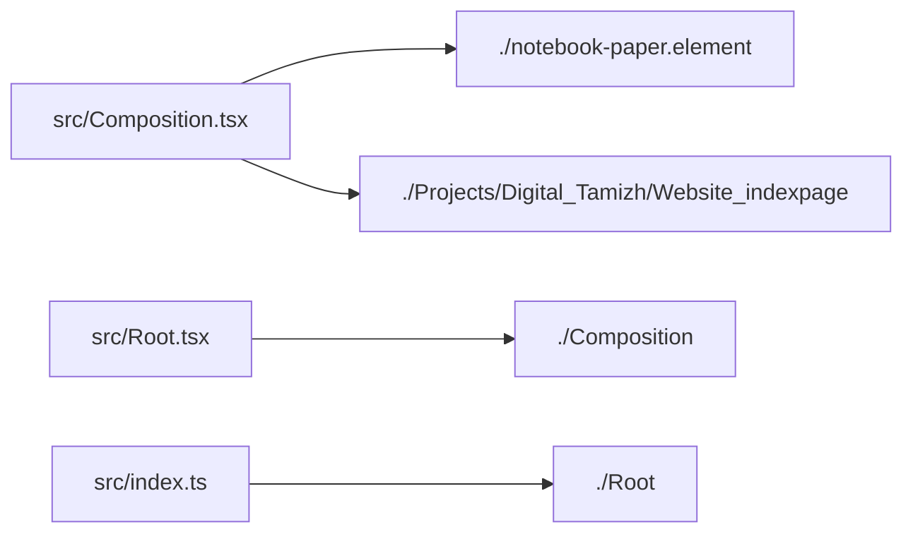

# Project Title: Maker_Portfolio_Sanjaiyan 

## Project Description

My Remotion video

Dependencies used in this project: 
   - **@huggingface/transformers** : `4.2.0`
   - **@remotion/animated-emoji** : `4.0.532`
   - **@remotion/animation-utils** : `4.0.532`
   - **@remotion/cli** : `4.0.532`
   - **@remotion/effects** : `4.0.532`
   - **@remotion/fonts** : `4.0.532`
   - **@remotion/google-fonts** : `4.0.532`
   - **@remotion/gsap** : `4.0.532`
   - **@remotion/lottie** : `4.0.532`
   - **@remotion/media-utils** : `4.0.532`
   - **@remotion/motion-blur** : `4.0.532`
   - **@remotion/noise** : `4.0.532`
   - **@remotion/paths** : `4.0.532`
   - **@remotion/player** : `4.0.532`
   - **@remotion/rive** : `4.0.532`
   - **@remotion/shapes** : `4.0.532`
   - **@remotion/starburst** : `4.0.532`
   - **@remotion/studio** : `4.0.532`
   - **@remotion/tailwind-v4** : `4.0.532`
   - **@remotion/three** : `4.0.532`
   - **@remotion/transitions** : `4.0.532`
   - **@remotion/whisper-web** : `4.0.532`
   - **@remotion/whisper-webgpu** : `4.0.532`
   - **react** : `19.2.3`
   - **react-dom** : `19.2.3`
   - **remotion** : `4.0.532`
   - **tailwindcss** : `4.0.0`

Dev dependencies used in this project: 
   - **@remotion/eslint-config-flat** : `4.0.532`
   - **@types/react** : `19.2.7`
   - **@types/web** : `0.0.166`
   - **eslint** : `9.39.5`
   - **prettier** : `3.8.1`
   - **typescript** : `5.9.3`

#### Project Version: 1.0.0 


---

## Project File Structure & PEG Graph

```
📁 
├── README.md
├── eslint.config.mjs
├── package-lock.json
├── package.json
├── public/
├── remotion.config.ts
├── skills-lock.json
├── src/
│   ├── Composition.tsx
│   ├── Projects/
│   │   └── Digital_Tamizh/
│   │       └── Website_indexpage.tsx
│   ├── Root.tsx
│   ├── index.css
│   ├── index.ts
│   └── notebook-paper.element.tsx
├── tsconfig.json
└── urai.config.jsonc
```

### Module Dependency Graph



---

## React Component Architecture & Explanations

### React Component Breakdown: `<MyComposition>` 

- **Props**: Receives no explicit props (or uses `children` only).
- **State**: Stateless component.
- **Rendered JSX Tree**: `<Composition>` 

### React Component Breakdown: `<MyComponent>` 

- **Props**: Receives no explicit props (or uses `children` only).
- **State**: Stateless component.
### React Component Breakdown: `<RemotionRoot>` 

- **Props**: Receives no explicit props (or uses `children` only).
- **State**: Stateless component.
- **Rendered JSX Tree**: `<MyComposition>` 

### React Component Breakdown: `<Website_IndexPage>` 

- **Props**: Receives no explicit props (or uses `children` only).
- **State**: Stateless component.
- **Rendered JSX Tree**: `<div>, <h3>, <p>, <span>, <h1>, <a>` 

### React Component Breakdown: `<NotebookPaper>` 

- **Props**: Receives no explicit props (or uses `children` only).
- **State**: Stateless component.
- **Hooks**: Uses `useVideoConfig` (Total Side-Effects: 0).
- **Rendered JSX Tree**: `<Solid>` 

---

## AST-Pruned Source Code Repository

> Note: Tailwind classNames and static styles have been pruned according to mode to maximize token efficiency.

### File: `eslint.config.mjs`

```javascript
import { config } from "@remotion/eslint-config-flat";
export default config;

```

### File: `remotion.config.ts`

```typescript
import { Config } from "@remotion/cli/config";
import { enableTailwind } from '@remotion/tailwind-v4';
Config.setRspack(true);
Config.setOverwriteOutput(true);
Config.overrideBundlerConfig(enableTailwind);
Config.setCodec('h265');
Config.setAudioCodec('aac');
Config.setVideoImageFormat('png');

```

### File: `src/Composition.tsx`

```typescript
import { NotebookPaper } from "./notebook-paper.element";
import { CalculateMetadataFunction, Composition, IFrame, Sequence } from "remotion";
import { Website_IndexPage } from "./Projects/Digital_Tamizh/Website_indexpage";
type Props = {
};
const calculateMetadata: CalculateMetadataFunction<Props> = ()=>{
    '/* "Executes logic for function calculateMetadata" */';
};
export const MyComposition = ()=>{
    return (<Composition id="MyComp" component={MyComponent} durationInFrames={60} fps={30} width={1280} height={720} calculateMetadata={calculateMetadata}/>);
    '/* "Executes logic for function MyComposition" */';
};
export const MyComponent: React.FC<Props> = ()=>{
    return (<>
  
    </>);
    '/* "Executes logic for function MyComponent" */';
};

```

### File: `src/Root.tsx`

```typescript
import "./index.css";
import { MyComposition } from "./Composition";
export const RemotionRoot: React.FC = ()=>{
    return (<>
      <MyComposition/>
    </>);
    '/* "Executes logic for function RemotionRoot" */';
};

```

### File: `src/index.ts`

```typescript
import { registerRoot } from "remotion";
import { RemotionRoot } from "./Root";
registerRoot(RemotionRoot);

```

### File: `src/Projects/Digital_Tamizh/Website_indexpage.tsx`

```typescript
export const Website_IndexPage = ()=>{
    return (<>
      <div>
        <div>
          <div style={{
        opacity: 1,
        transform: "none"
    }}>
            <div>
              <div style={{
        transform: "translateX(3.8%)"
    }}></div>
              <div>
                <div>
                  <div></div>
                  <div></div>
                </div>
                <div>
                  <h3>
                    Something Big is Coming Soon
                  </h3>
                  <p>
                    Finetuning LLM for தமிழ்
                  </p>
                </div>
              </div>
            </div>
            <div></div>
          </div>
          <div>
            <div>
              <div>
                A
              </div>
              <div>
                漢
              </div>
              <div>
                あ
              </div>
              <div>
                අ
              </div>
              <div>
                א
              </div>
              <div>
                Ω
              </div>
              <div>
                어
              </div>
              <div>
                ゑ
              </div>
            </div>
            <div style={{
        opacity: 1,
        transform: "scale(2)"
    }}>
              <div style={{
        transform: "translateY(-8.837789px) rotateZ(8.11614deg)"
    }}>
                அ
              </div>
              <div>
                <div></div>
                <span>
                  யாதும் ஊரே யாவரும் கேளிர்
                </span>
                <div></div>
              </div>
              <p>
                To us, all towns are one, all men our kin
              </p>
            </div>
            <div style={{
        opacity: 0,
        transform: "translateY(-16.666667px) scale(0.833333)"
    }}>
              <h1>
                தமிழ்
              </h1>
            </div>
          </div>
          <div>
            <div></div>
            <div></div>
            <div>
              <div>
                <a href="/hugging-face/Tamil-Digital-Heritage-Corpus">
                  <div style={{
        opacity: 1,
        transform: "none"
    }}>
                    <div>
                      <span>
                        Hugging Face
                      </span>
                      <span>
                        01/03
                      </span>
                    </div>
                    <h3>
                      Digital Heritage Corpus
                    </h3>
                    <p>
                      A massive curated dataset of ancient manuscripts and
                      contemporary literature.
                    </p>
                    <div>
                      <div></div>
                    </div>
                  </div>
                </a>
                <a target="__blank" href="https://github.com/digital-tamil/thiruppugazh-sandhi-rs">
                  <div style={{
        opacity: 1,
        transform: "none"
    }}>
                    <div>
                      <span>
                        GitHub
                      </span>
                      <span>
                        02/03
                      </span>
                    </div>
                    <h3>
                      Thiruppugazh Sandhi
                    </h3>
                    <p>
                      Sophisticated rule-based sandhi decomposition tool for
                      Tamil poetry.
                    </p>
                    <div>
                      <span></span>
                      <span>
                        Active Build
                      </span>
                    </div>
                  </div>
                </a>
                <a href="/tamil-simple-ocr">
                  <div style={{
        opacity: 1,
        transform: "none"
    }}>
                    <div>
                      <span>
                        GitHub
                      </span>
                      <span>
                        03/03
                      </span>
                    </div>
                    <h3>
                      Tamil Simple OCR
                    </h3>
                    <p>
                      Minimalist, high-accuracy optical character recognition
                      for Tamil scripts.
                    </p>
                    <div>
                      97.3% Accuracy
                    </div>
                  </div>
                </a>
              </div>
            </div>
          </div>
        </div>
      </div>
    </>);
    '/* "Executes logic for function Website_IndexPage" */';
};

```

### File: `src/notebook-paper.element.tsx`

```typescript
import { gridlines } from '@remotion/effects/gridlines';
import { paper } from '@remotion/effects/paper';
import React from 'react';
import { Solid, useVideoConfig } from 'remotion';
export const NotebookPaper: React.FC = ()=>{
    return (<Solid color={'#ffffff'} width={width} height={height} effects={[
        paper({
            amount: 0.38,
            colorFront: 'white',
            colorBack: 'white',
            contrast: 0.18,
            roughness: 0.18,
            fiber: 0.28,
            crumples: 0.1,
            folds: 0.12,
            seed: 24,
            scale: 0.8,
            drops: 0
        }),
        gridlines({
            gridSize: 54,
            lineWidth: 3.4,
            lineColor: 'rgba(76, 101, 128, 0.16)'
        })
    ]}/>);
    '/* "Executes logic for function NotebookPaper" */';
};

```


